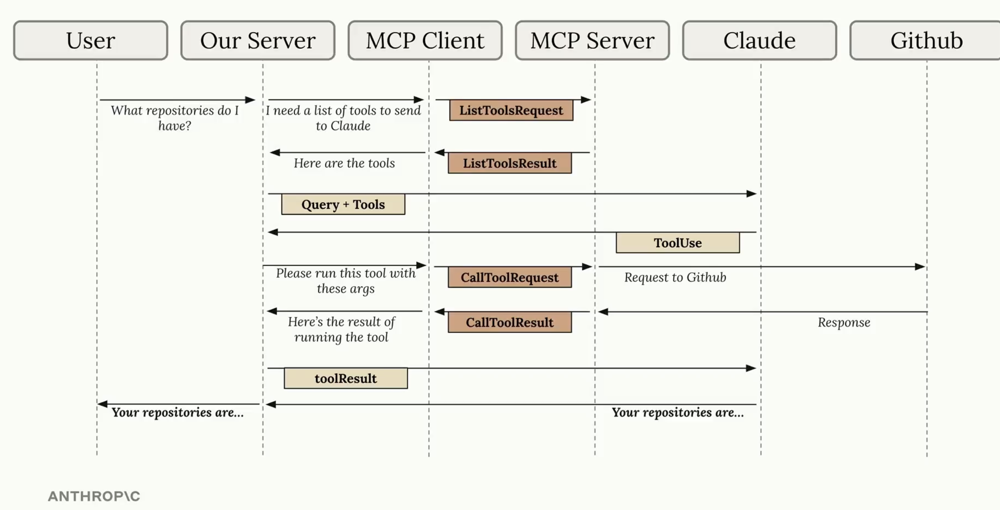

# Model Context Protocol 

## Notes

Our server usually has a MCP client inside that communicates with a MCP server somewhere outside the server. 

**Transport Agnostic**: the communication between client and server can be done over many different protocols.
- Standard I/O
- HTTP
- WebSockets

The MCP [specification](https://modelcontextprotocol.io/specification) defines different types of messages that can be exchanged.

MCP Flow:
